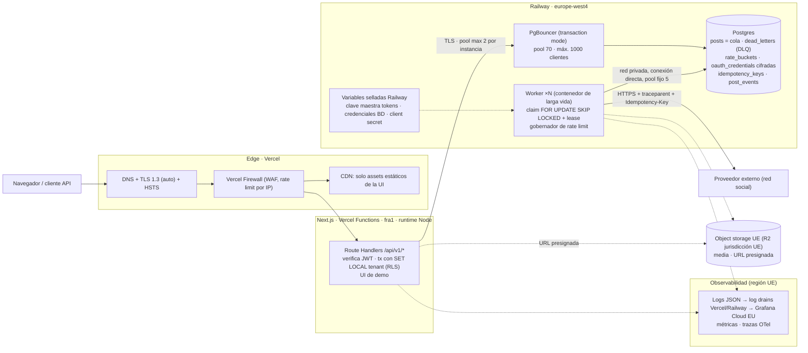

# Ploot · Prueba técnica de Backend — Respuestas escritas

> **URL pública:** https://ploot-scheduler.vercel.app · **Repo:** https://github.com/marcgue45/ploot-scheduler (PR `assessment`)

## Asunciones globales

1. "5.000 cuentas activas" = 5.000 Embajadores conectados (~500–1.000 tenants). A 50× → 250k Embajadores.
2. Volumen: ~1–3 posts/Embajador/día, concentrados en franjas (pico 09:00 CET). Hoy ≈ 10k posts/día, pico de decenas/s; a 50× ≈ 500k/día, pico de cientos/s.
3. Límites del proveedor desconocidos → configurables. Operamos **por debajo** del límite publicado (margen 20–50 %) porque el coste de un ban es mucho mayor que el de un retraso.
4. `POST /publish` ("publicar ahora") es **asíncrono**: encola con `scheduled_at = now()` y devuelve `202`. Llamar al proveedor (0–3 s + reintentos) dentro del request rompería el p95 < 4 s y saltaría el gobernador de rate limit.
5. Ploot es **encargado** del tratamiento (GDPR); el tenant es responsable. Las solicitudes de derechos llegan vía el tenant.
6. **El proveedor acepta `Idempotency-Key` en `/publish`** (lo implementa nuestro mock; el contrato del enunciado no lo menciona). Sin deduplicación en el proveedor, *exactly-once* es imposible ante un crash entre su `200` y nuestro commit; la alternativa sería un estado `unknown` + reconciliación.

---

## A. Diseño de sistema

### A.1 — Arquitectura de referencia

**Host elegido: Vercel (app Next.js, región `fra1` Frankfurt) + Railway (worker, Postgres + PgBouncer, región `europe-west4` Países Bajos).** Es exactamente lo que está desplegado: la arquitectura que defiendo es la que se puede tocar en la URL pública. Todo el dato reside en la UE.



**Node vs Edge.** Todo lo que toca datos corre en **runtime Node en `fra1`**: `pg` necesita sockets TCP (Edge no los tiene), y una función Edge se ejecuta cerca del usuario, lejos de la BD, con lo que cada query cruzaría Europa. El Edge solo sirve TLS, WAF y assets estáticos. La verificación del JWT también va en Node, dentro del Route Handler, porque el `tenant_id` del token tiene que entrar en la misma transacción de BD (RLS).

| Pieza | Elección | Alternativa descartada y su coste | $/mes a 5k |
|---|---|---|---|
| Edge | Vercel Edge Network + Vercel Firewall | Cloudflare delante: doble proxy, dos capas de caché y otra cuenta, para un WAF que Vercel ya incluye | incl. |
| App | Vercel Functions, `fra1`, Node | Next.js en contenedor en Railway: un proveedor menos, pero perdemos preview deploys por PR, rollback instantáneo y autoescalado sin operar | ~100 (Pro + uso) |
| Worker | Contenedor de larga vida en Railway, 2 réplicas (0,5 vCPU / 0,5 GB), misma red privada que la BD | AWS Fargate: tiene identidad de workload (IAM), pero suma VPC, IAM y otra factura. Vercel Cron + funciones: timeouts, cold starts, sin estado de throttling (descartado por requisito) | ~30 |
| Cola + DLQ | La tabla `posts` es la cola (`SKIP LOCKED`). DLQ = `failed` + tabla `dead_letters` | SQS: delay máximo 15 min, así que los 90 días necesitarían igualmente tabla + barredor, con *dual write* BD↔cola. BullMQ + Redis: segunda fuente de verdad que mantener en HA | 0 |
| Gobernador rate limit | Token bucket de app en Postgres (fila `rate_buckets`) + throttle y pausa por Embajador + round-robin por tenant, en la misma tx que el claim | Redis + Lua: más rápido, pero otra pieza. A 5k el pico (decenas/s) cabe en Postgres; migramos cuando la fila del bucket tenga contención (~cientos de claims/s) | 0 |
| Bóveda de tokens | Tokens en Postgres cifrados AES-256-GCM (AAD = tenant:Embajador). Clave maestra en variable sellada de Railway, solo visible para el worker | AWS KMS: HSM y auditoría por uso, pero desde Railway exige una clave IAM estática (no hay identidad de workload). Secrets Manager por token: 0,40 $/secreto → 2k $/mes hoy | 0 |
| Postgres | Railway Postgres en `europe-west4`; en producción HA (`railway postgres ha`, 3 nodos) + PITR | Neon: pooler integrado y ramas por PR, pero sería un tercer proveedor y su red no es privada con el worker. RDS: más maduro, pero obliga a VPC y Secure Compute desde Vercel | ~150–250 (HA) |
| Pooler | PgBouncer gestionado de Railway, transaction mode, para la app serverless. El worker y las migraciones conectan directos | RDS Proxy (no aplica). Sin pooler: N instancias × pool agotan `max_connections` en el pico | ~10 |
| Caché | **Ninguna dedicada** al principio | Redis: no hay nada con valor que cachear. Las lecturas son por tenant y pequeñas, y la idempotencia necesita durabilidad transaccional (Postgres) | 0 |
| Object storage | Cloudflare R2 con jurisdicción UE (sin coste de egress hacia el proveedor) | S3: cobra egress en cada subida de media al proveedor. Vercel Blob: sin garantía de región UE | ~5–20 |
| Secrets / identidad | Variables por entorno: Vercel (marcadas *sensitive*) y Railway (selladas: no se pueden leer de vuelta). Un rol de BD por proceso | Secrets Manager/Vault: mejor rotación y auditoría, pero sin identidad de workload desde Railway seguiría haciendo falta una credencial estática para leerlo | 0 |
| Observabilidad | Logs JSON estructurados → log drains de Vercel y Railway → Grafana Cloud EU; trazas OpenTelemetry | Datadog: el coste de logs se dispara con el volumen. Solo los logs de cada plataforma: no correlacionan app y worker | ~50–100 |
| **Total** | | | **~350–550 $/mes** |

**Hueco declarado y disparador de migración.** Railway no ofrece identidad de workload, así que la clave maestra de los tokens es una variable sellada (estática, rotada a mano) y no hay KMS/HSM. Lo acepto a 5k Embajadores con controles compensatorios: solo el servicio worker la ve, el rol de la app no puede leer el ciphertext y la rotación está soportada (`key_version`). **Disparador para mover worker + claves a AWS (Fargate + KMS vía IAM role):** un cliente enterprise que exija KMS/BYOK o auditoría SOC 2, o superar ~50k Embajadores.

### A.2 — Tokens, rate limits, datos y conexiones

**1. Tokens OAuth.**
- **Dónde y cómo se cifran.** En la tabla `oauth_credentials` (`tenant_id`, `ambassador_id`, `access_token_ct`, `refresh_token_ct`, `expires_at`, `status valid|revoked`, `key_version`). AES-256-GCM con AAD = `tenant_id:ambassador_id`, así que un ciphertext copiado a otra fila no descifra. Solo el rol de BD del worker lee esas columnas; el rol de la app tiene `GRANT` solo sobre `status` y `expires_at`.
  - *Implementado:* una clave maestra (variable sellada del worker).
  - *Siguiente paso:* una DEK por Embajador envuelta por la clave maestra. Así, borrar la DEK hace ilegible cualquier copia del token (*crypto-shredding*, ver punto 4).
- **Refresco antes de expirar.** *Just-in-time*: antes de publicar, si el token caduca en menos de 60 s, el worker lo refresca. No hay carrera entre réplicas porque un índice único garantiza 1 post en vuelo por Embajador, así que solo una réplica puede refrescar su token a la vez. Con *refresh token rotation*, dos refrescos simultáneos se invalidarían entre sí. *Siguiente paso:* un barrido proactivo de los tokens que caducan en menos de 10 min, para que el refresh no sume latencia al pico.
- **Revocado a mitad de lote.** El refresh devuelve `invalid_grant` → la credencial pasa a `revoked` y el post en curso a `failed/TOKEN_REVOKED`, **sin gastar reintentos**. El Embajador queda en pausa indefinida (`paused_until = infinity`): el resto de sus posts **no se queman** uno a uno contra el proveedor y se reanudan si reconecta. El claim es por post, así que el resto del lote, de otros Embajadores, no se ve afectado.
- **Tenancy.** Modelo *pool*: tabla compartida con `tenant_id` + RLS. Descartamos un silo por tenant (5k esquemas o BDs que migrar y conectar).

**2. Gobierno del rate limit.** Implementado en `worker/src/claim.ts`, en la misma transacción que el claim. Son tres capas:
- **App (cuota compartida).** Token bucket en la fila `rate_buckets('app')`, configurado al 80 % de la cuota real. Un 429 con scope app vacía el bucket y pausa la app hasta `Retry-After`. Además, un **cap global de concurrencia**: nunca más de N posts en vuelo entre todas las réplicas, contado en BD.
- **Embajador.** Como mucho 1 post en vuelo (índice único `posts_one_inflight_per_ambassador`), un intervalo mínimo propio con jitter entre publicaciones (`next_allowed_at`, para no publicar con patrón de bot) y una pausa por 429 que respeta `Retry-After` **sin gastar intento ni adelantar su cola**.
- **Equidad entre tenants.** El claim coge la cabeza de cola de cada Embajador elegible y la ordena por `row_number() OVER (PARTITION BY tenant_id)`, es decir, en *round-robin* por tenant. Un tenant con 50 Embajadores × 100 posts a las 09:00 recibe su parte justa mientras otros tengan trabajo, y usa la capacidad sobrante cuando no la tienen (*work-conserving*).
- **Modos de fallo.**
  - BD caída → **fail closed**: no se publica. Retrasar es recuperable; un ban no.
  - La fila del bucket de app serializa los claims: un worker que la encuentra bloqueada no espera (`SKIP LOCKED`), reintenta en el siguiente ciclo. A cientos de claims/s sería un *hot row* → bucket en Redis o un único dispatcher que reparta tokens por lotes.
  - *Siguiente paso:* un bucket por tenant con cuota proporcional al plan (hoy la equidad es por turnos, no por presupuesto).

**3. Query caliente + conexiones bajo serverless.**
- **Índices** (parciales: los millones de filas `published` no entran):
  - `posts (run_at) WHERE status = 'scheduled'`, para localizar Embajadores con trabajo vencido;
  - `posts (ambassador_id, scheduled_at, id) WHERE status = 'scheduled'`, para la cabeza de cola de cada Embajador.
- **Forma de la query** (simplificada):
  ```sql
  WITH due AS (SELECT DISTINCT ambassador_id FROM posts WHERE status = 'scheduled' AND run_at <= now()),
  heads AS (SELECT a.tenant_id, h.* FROM due d JOIN ambassadors a ON a.id = d.ambassador_id
            CROSS JOIN LATERAL (SELECT id, scheduled_at, run_at FROM posts
                                WHERE ambassador_id = d.ambassador_id AND status = 'scheduled'
                                ORDER BY scheduled_at, id LIMIT 1) h
            WHERE h.run_at <= now() AND <no pausado, throttle vencido, nada en vuelo>)
  SELECT id FROM (SELECT *, row_number() OVER (PARTITION BY tenant_id ORDER BY scheduled_at) rn FROM heads) r
  ORDER BY rn, scheduled_at LIMIT $n;
  -- después: UPDATE ... FROM (SELECT id ... FOR UPDATE SKIP LOCKED) -> 'publishing'
  ```
- **`EXPLAIN (ANALYZE, BUFFERS)` real.** Medido con `scripts/explain-claim.ts`, que importa la query exacta del worker, sobre `db/bench/seed_5m.sql`:
  - **Dataset:** 5,5M posts. El tenant grande (BigCorp) tiene 5,0M: 4,9M publicados, 90k programados a 90 días y 2.500 vencidos. Hay 1.000 tenants más y 3.504 posts vencidos (pico de las 09:00).
  - **Plan resultante:**
    ```
    Limit → Sort top-N (rn, scheduled_at) → WindowAgg → Sort (tenant_id, scheduled_at)
      → Nested Loop
          → Hash Join (ambassadors elegibles ⋈ Embajadores con trabajo vencido)
              → Hash Anti Join: Seq Scan ambassadors (5.050) ⋉ Index Only Scan posts_one_inflight_per_ambassador
              → Unique → Bitmap Index Scan posts_due_run_at_idx   (3.504 filas, 6 buffers)
          → Limit 1 → Index Scan posts_ambassador_head_idx        (1.054 loops, ~0,003 ms cada uno)
    Execution Time: 22–24 ms   ·   Buffers: shared hit≈4.300
    ```
  - **Lectura del plan:** el coste es O(Embajadores con trabajo vencido) = 1.054 sondas de índice, y **no depende de los 5M de histórico**, que no entran en ningún índice parcial.
  - **Hallazgos de la medición** (aplicados al código):
    1. **Paralelismo innecesario.** Postgres lanzaba 2 workers paralelos cuyo arranque costaba más que la query: 52 ms → **22 ms** con `SET LOCAL max_parallel_workers_per_gather = 0` en la tx del claim. Además, acorta el tiempo que se retiene la fila del bucket de app.
    2. **RLS + enum no *leakproof*.** El listado de la API filtrado por un estado raro (`status=failed`) en BigCorp tardaba **1.212 ms**, recorriendo los 5M de filas, frente a 0,07 ms sin RLS. La causa: `enum_eq` no es *leakproof*, así que Postgres no puede usar el predicado del usuario como condición de índice junto a la política RLS. Migración `002`: `status` pasa a `text + CHECK` (`texteq` sí es leakproof) → **0,066 ms**, con `Index Cond: (tenant_id = … AND status = 'failed')`.
    3. **Límite conocido.** `status=published` (98 % del tenant) tarda 49 ms: el planner prefiere el índice `(tenant_id, created_at)` y descarta ~90k programados más recientes. Es un error de estimación por correlación entre columnas; está muy por debajo del p95 de 4 s y no lo toco.
- **Conexiones desde la app.** Cada instancia serverless usa la URL de **PgBouncer** (transaction mode) con `max: 2`. PgBouncer acepta hasta 1000 clientes y los multiplexa sobre 70 conexiones reales.
- **Implicaciones del transaction mode.** No hay estado de sesión: el tenant se fija con `set_config('app.tenant_id', $1, true)` (equivalente a `SET LOCAL`) dentro de la tx, y no se usan advisory locks de sesión ni `LISTEN`. Con los prepared statements, usamos `pg` con sentencias sin nombre, que no tienen problema (además, el PgBouncer gestionado tiene `max_prepared_statements=300`). Prisma necesitaría `pgbouncer=true`.
- **Conexiones del worker.** El worker, de larga vida, va **directo** por red privada, sin pooler, con un pool fijo de 5 por réplica. Las migraciones también van directas, porque usan un advisory lock de sesión.
- **Presupuesto.** `max_connections` ≥ 70 (PgBouncer) + N workers × 5 + reserva de administración.

**4. GDPR — borrado de un Embajador.**
- **Encaje legal.** Se ejecuta como job idempotente (`erasure_requests`) a petición del tenant, que es el responsable.
- **Tokens.** Se revocan en el proveedor y se borra la fila. Con DEK por Embajador (siguiente paso de A.2.1), borrar la DEK deja ilegible cualquier copia en backups.
- **Posts en cola.** Se cancelan y se borran.
- **Posts publicados.** Se borra el contenido y la media, y se conserva una fila mínima sin PII (`id`, `tenant_id`, `published_at`) para la facturación por uso. El dato contable, facturas del tenant que se conservan 6 años (art. 30 Código de Comercio), es de la empresa y no del Embajador.
- **Anonimización.** La fila del Embajador se anonimiza (nombre a `NULL`, handle a un hash) para mantener la integridad referencial. `post_events` y `dead_letters` solo guardan IDs y códigos.
- **Contenido en la red social.** Lo publicado allí está en la cuenta del propio Embajador. Si lo pide, se borra vía API **antes** de revocar el token.
- **Rastros:**
  - **Logs:** no contienen PII por diseño (solo IDs; nunca contenido ni tokens) y caducan a 30 días.
  - **Cachés:** no hay caché de datos del tenant; la API responde dinámica, sin caché de CDN.
  - **Backups:** el PITR caduca a los 14 días, y una **lista de supresión** (IDs borrados) se reaplica tras cualquier restore.
- **Prueba.** Se guarda un registro de auditoría sin PII (id de solicitud y fecha).

---

## B. Despliegue y operación

### B.1 — Topología de despliegue y capa asíncrona

- **App Next.js.** Vercel, funciones en `fra1`, con TLS automático y HSTS. Las variables de entorno van por entorno (Production y Preview en Vercel); los secretos se marcan *sensitive* (no se pueden leer de vuelta) y las previews no reciben los de producción. Nada en el repo: `.env.example` solo documenta nombres.
- **Worker de larga vida en Railway.** Contenedor `node` del mismo `Dockerfile` (`APP_ROLE=worker`), en la misma red privada que Postgres. No puede ser una función de Next.js por varias razones:
  - Las funciones tienen timeout y cold start.
  - Vercel Cron tiene una granularidad de ≥ 1 min.
  - No conservan el estado del throttling entre invocaciones.
  - Cada invocación abriría conexiones nuevas.

  El proceso de larga vida mantiene un pool fijo, trabaja con leases y hace un *drain* ordenado con SIGTERM: deja de reclamar, termina lo que tiene en vuelo y cierra el pool. El mock también es un servicio de Railway (`APP_ROLE=mock`), y el worker lo llama por red privada.
- **Cola + DLQ en Postgres.** El estado del post *es* el job, así que el claim y la transición de estado son atómicos, sin *dual write*. Los 90 días de antelación son nativos (`scheduled_at`) y la cola se audita con SQL. La DLQ está formada por los `failed` más `dead_letters`, que guarda el código de error y los intentos. El límite (cientos a miles de claims/s) sobra para 50×.
- **Postgres.** Railway Postgres en `europe-west4`, con volumen cifrado en reposo y TLS en el proxy público. Delante va un **PgBouncer** gestionado (transaction mode) para la app. Los backups son los de Railway; en producción, PITR (`railway postgres pitr enable`) y HA (`railway postgres ha`, 3 nodos). Hay un rol de BD por proceso: `ploot_app` (sin `BYPASSRLS`), `ploot_worker` y el admin solo para migraciones.
- **Secretos.**
  - Viven en variables por servicio: selladas en Railway y *sensitive* en Vercel. Cada proceso ve solo los suyos: la clave de cifrado de tokens existe únicamente en el worker.
  - **Sin identidad de workload en Railway** (hueco declarado en A.1): las credenciales son estáticas, se rotan con dos usuarios alternos y viven solo en el host, nunca en el repo ni en el state.
  - El repo pasa `gitleaks` en CI sobre todo el historial.

### B.2 — CI/CD y observabilidad

**1. Forma del pipeline** (`.github/workflows/ci.yml` y despliegues por Git).
- **En cada PR.** Se ejecutan:
  - typecheck;
  - tests de integración contra un Postgres de servicio (concurrencia con N workers, crash, RLS, DST, idempotencia y errores);
  - `gitleaks`;
  - build de la imagen.

  Además, Vercel crea un preview deploy por PR, y lo ideal es un entorno efímero de Railway por PR (PR environments) con su propia BD.
- **Al mergear a `main`.** Se publica la imagen en GHCR con tag del SHA y `latest` (la usa `docker compose`). Se ejecuta *una vez* el job de migraciones (solo *expand*). Se despliega en staging y se pasa un smoke e2e: crear un post, publicarlo contra el mock y verificar `published`.
- **Paso a producción.** Usa un GitHub Environment con **aprobación manual**. Lo bloquean cualquier check en rojo, una migración fallida o un smoke fallido.
- **Rollback automático.** Durante 15 min tras el deploy se vigilan tres señales: la tasa de publicación exitosa (si cae más de 5 puntos frente a la línea base), los 5xx de la API (si superan el 2 %) y el p95 (si supera 4 s). Si alguna salta, se hace *instant rollback* en Vercel y se redespliega en Railway la imagen anterior. Es seguro porque las migraciones son siempre compatibles con la versión anterior.

**2. Migraciones.**
- **Una sola vez.** Nunca se ejecutan al arrancar la app (N instancias competirían). Las corre un único job one-shot (`npm run db:migrate`; en compose, el servicio `migrate`), protegido con `pg_advisory_lock` y `lock_timeout`. Usa conexión directa, no PgBouncer, porque el advisory lock es de sesión.
- **Expand/contract.**
  - **Release N:** añade columnas nullable, tablas nuevas e índices `CONCURRENTLY`.
  - **Release N+1:** escribe en ambos esquemas y lee del nuevo; el backfill se hace por lotes desde el worker.
  - **Release N+2:** hace el *contract* (DROP), solo cuando ya no puede volver una versión anterior a N+1.
- **Regla.** Toda migración es compatible con el código anterior, así que un rollback de Vercel nunca encuentra un esquema incompatible.

**3. Golden signals + negocio.**
- **Latencia:** p95 de la API (SLO < 4 s) y latencia de la llamada al proveedor (`latency_ms` en el log `post published`).
- **Tráfico:** req/s y claims/s.
- **Errores:** 5xx de la API y `outcome` del worker por código (`PROVIDER_5XX`, `TOKEN_REVOKED`…).
- **Saturación:** conexiones de BD y de PgBouncer, posts en vuelo frente al cap global y **consumo del bucket de app** (`queue_stats` cada 15 s: `due`, `inflight`, `oldest_due_lag_s`, `paused_ambassadors`, `app_paused`).
- **Negocio:** **lag de publicación** (`published_at − scheduled_at`, p95, y `oldest_due_lag_s`), más la tasa de éxito por tenant.

**Pagina a un humano:**
- lag p95 > 10 min sostenido, porque la promesa del producto está rota y el cliente lo ve;
- `app_paused` (429 de app) > 5 min o tasa de 429 > umbral, porque hay riesgo de ban, que es irreversible;
- conexiones de BD > 90 %, porque precede a una caída total.

**Solo abre ticket:**
- caída de éxito de *un* tenant (normalmente tokens; se resuelve en horario laboral);
- p95 > 4 s;
- 5xx del proveedor absorbidos por los reintentos;
- crecimiento de la DLQ.

Criterio: se pagina solo por síntomas que dañan al usuario o a sus cuentas *ahora* y que necesitan a un humano.

**4. Tracing distribuido.** Se usa W3C `traceparent`.
- **Route Handler → cola.** Como la cola es una tabla, el contexto viaja **como dato**: el Route Handler acepta el `traceparent` entrante (o genera un `trace_id`) y lo guarda en la fila del post (`posts.trace_id`).
- **Cola → worker.** El worker lo lee al reclamar y lo incluye en todos sus logs. Al instrumentar con OpenTelemetry, el span del worker se crea con **link** al original, no como hijo: el post puede ejecutarse 90 días después.
- **Worker → proveedor.** El worker propaga un `traceparent` nuevo con el mismo `trace_id` en la llamada HTTP y registra el `external_id` devuelto.
- **Claves de correlación.** `post_id` es la clave estable en logs y en la tabla `post_events`.

### B.3 — Seguridad

**1. Inventario de secretos.**

| Secreto | Dónde vive | Rotación |
|---|---|---|
| Token OAuth por Embajador | Postgres, cifrado AES-256-GCM; solo lo descifra el worker | El access token rota solo vía refresh. Para la clave maestra: `key_version` + re-cifrado por lotes desde el worker |
| Client secret del proveedor | Variable sellada del worker en Railway | Se crea un segundo secret en el proveedor, se actualiza la variable (redeploy sin downtime) y se revoca el antiguo. Cada 90 días o ante incidente |
| Credenciales de BD | Variables: `ploot_app` en Vercel (*sensitive*), `ploot_worker` en Railway (sellada); admin solo en el job de migraciones | Usuarios alternos: se crea la nueva contraseña o usuario, se despliega y se invalida la anterior. Cada 90 días |
| Clave maestra de cifrado | Variable sellada del worker | Anual o ante incidente, vía `key_version` |
| Clave de firma JWT | Variable *sensitive* en Vercel | Solapamiento de dos claves (`kid`) durante la rotación |

**Riesgo de las variables de entorno en el host:**
- son visibles para cualquiera con permisos sobre el proyecto (dashboard y `vercel env pull`), salvo las *sensitive*/selladas;
- se heredan en previews si no se separan por entorno, así que una rama maliciosa podría exfiltrarlas;
- pueden acabar en logs si se serializa `process.env`;
- un prefijo `NEXT_PUBLIC_` por error las mete en el bundle del cliente;
- son estáticas y tienden a no rotarse nunca.

Mitigación: secretos marcados como *sensitive*/sellados, scopes por entorno, cada proceso solo con lo suyo, y logs que nunca vuelcan configuración.

**2. Sin credenciales permanentes de producción.** Nadie tiene un usuario de BD de producción.
- **Acceso JIT.** Se pide con un comando (`ops db-access --incident INC-123`) vía SSO.
  - El on-call con incidente abierto se auto-aprueba; fuera de incidente hace falta una segunda persona.
  - El comando crea un rol temporal `jit_<user>` con `VALID UNTIL now()+1h`, de solo lectura y sin acceso a `oauth_credentials` (los mismos `GRANT` por columna que la app).
- **Escritura.** Requiere *four-eyes*.
- **Auditoría.** Todo queda registrado con `pgaudit`.
- **Tiempo.** Son unos 2 min. El acceso al proyecto de Railway se limita a 2 personas con 2FA.

**3. Tres controles diferidos 6 meses:**
1. **KMS/HSM e identidad de workload** (mover worker y claves a AWS). Lo compensamos con variables selladas, aislamiento por servicio y rotación con `key_version`. Disparador: la exigencia de un cliente enterprise.
2. **Red privada hacia la BD desde Vercel** (hoy, proxy TCP público con TLS). La compensamos con TLS, un rol de mínimo privilegio con RLS y credenciales rotadas.
3. **Certificación SOC 2 / ISO 27001.** Cuesta meses de proceso y 20–50k € de auditoría. Aplicamos las prácticas sin la auditoría hasta que un deal enterprise la exija.

Diferirlos es correcto porque el riesgo residual es bajo, hay controles compensatorios y para un equipo pequeño cada uno cuesta semanas que hoy deben ir al producto.

---

## D. Operaciones — D.1: 429 masivo + conexiones agotadas a las 09:00

**Lectura del escenario.** Son dos incidentes simultáneos que hay que separar antes de actuar:

1. **El proveedor nos frena (429).** Es riesgo de ban, irreversible, y por eso es la prioridad.
2. **La API se ahoga por conexiones.** Es degradación, recuperable.

En nuestro diseño están **desacoplados**:

- La API no llama al proveedor: `publish` solo encola y devuelve 202.
- La app pasa por PgBouncer.
- El worker usa sus propias conexiones directas.

Por eso, si coinciden, hay que buscar una causa común a las 09:00, no asumirla.

### Detección (minuto 0–2)

- **Pagina** `app_paused` > 5 min, es decir, el circuit breaker de app abierto por 429 con `scope=app`.
- **Pagina** conexiones de BD > 90 % o cola de PgBouncer creciendo, con el p95 de la API por encima de 4 s.
- **Llega después** el lag de publicación (`oldest_due_lag_s` en `queue_stats`) > 10 min.
- **Si los 429 fueran por usuario y no de app,** la señal sería `paused_ambassadors` disparado, no `app_paused`. Distinguirlo es el primer paso del diagnóstico.

### Diagnóstico (minuto 2–8)

Las señales son síntomas; antes de tocar nada se confirman las causas.

- **¿Qué 429 son?** En los logs del worker (`outcome=rate_limited`) se mira la proporción `scope=app` frente a `scope=user` y los `Retry-After`.
- **¿Obedece el worker?** Con `app_paused` activo no debería salir ninguna petición al proveedor. Si salen, es un bug: se escala a 0 réplicas.
- **¿La app usa el pooler?** Se comprueba que el `DATABASE_URL` de Vercel apunta a PgBouncer y no a Postgres directo. Se tarda 30 s y, si está mal, es la causa raíz del problema de conexiones.
- **¿Quién retiene las conexiones?**
  - `pg_stat_activity` agrupado por `application_name`/`usename` (`ploot-app` frente a `ploot-worker`).
  - `SHOW POOLS` en PgBouncer, para ver los clientes en espera (`cl_waiting`).
  - Los logs de la API por ruta y duración. Sospechoso habitual: **tormenta de polling** de miles de Embajadores mirando a las 09:00 si su post salió.

### Mitigación (minuto 5–20)

**Objetivo 1: cero riesgo de ban.**

- La pausa de app ya está activa: el bucket queda a 0 fichas y nadie publica hasta `Retry-After`. **No se toca la cola**: un post esperando en `scheduled` no gasta cuota ni arriesga cuentas. Lo peligroso eran los reintentos, y ya están parados.
- **Reapertura gradual.** Al acabar la pausa, el bucket se rellena desde 0 a su ritmo (2/s), así que la cola sale en rampa, respetando el cap global, el intervalo por Embajador y el reparto por turnos entre tenants. Si los 429 vuelven, se baja `refill_per_sec` en la fila `rate_buckets` sin redesplegar.

**Objetivo 2: recuperar la API.**

1. Si el `DATABASE_URL` no apunta al pooler, se corrige y se redespliega (rollback instantáneo de Vercel si vino de un deploy).
2. Se frena la tormenta de polling con una regla del Vercel Firewall que limita `GET /api/v1/posts` por IP o token, y se sube el intervalo de polling de la UI.
3. Se cancelan en Postgres las queries que superen N segundos (`pg_cancel_backend`) y se fija un `statement_timeout` para el rol `ploot_app`.

**Lo que NO se hace, aunque sea tentador:**

- **Escalar workers para vaciar la cola.** No aumenta el ritmo, porque el bucket es compartido y el cap global es fijo. Además, cada worker abre 5 conexiones directas y empeora el otro incidente.
- **Subir el pool de PgBouncer a 500.** Traslada el cuello de botella a Postgres: más procesos, más memoria y más latencia para todos, también el worker.
- **Mandar la cola a la DLQ.** Convertiría posts sanos en `failed`, es difícil de deshacer y obliga a reprocesar a mano.
- **Reintentar a mano.** Es exactamente el retry-storm que provoca el ban.

**Comunicación.** Se publica un aviso en la página de estado ("publicaciones de las 09:00 con retraso, ninguna cuenta en riesgo"). En la UI, el porqué ya es visible por post (`APP_RATE_LIMITED`, `Retry-After`).

### Método de root cause (después del incidente)

- **Línea temporal reconstruida** con:
  - `post_events`, que da cada transición con su hora y actor;
  - los logs del worker, con cada 429, su `scope` y `Retry-After`, y el `trace_id` por post;
  - `queue_stats` cada 15 s;
  - los logs de la API por ruta y latencia;
  - las estadísticas de PgBouncer.
- **Primera pregunta:** ¿qué llegó primero, el pico de conexiones o los 429? ¿Hubo un deploy antes de las 09:00?
- **Cierre:** postmortem *blameless* con "5 porqués" sobre la causa común (concentración de todo el producto en un mismo minuto) y las acciones con dueño y fecha.

### Follow-up

**Producto:**

- **Franjas concurridas.** Al programar, si la franja está saturada, se avisa al Embajador ("las 09:00 están muy concurridas; puede salir con unos minutos de retraso") y puede elegir otra hora. Internamente, "09:00" se publica repartido entre 09:00 y 09:10 con jitter: para el usuario es natural y para el proveedor deja de ser una ráfaga.
- **Retraso máximo.** Si un post supera X minutos de retraso (configurable por tenant, por ejemplo 60 min), no sale sin más: pasa a "necesita decisión" y se pregunta al Embajador si publicar ahora, reprogramar o editar. Un post sobre "esta mañana" puede no tener sentido a las 11:00.

**Sistema:**

- **Circuit breaker *half-open* explícito.** Al acabar `Retry-After`, una sola petición de prueba antes de abrir la rampa.
- **Bucket por tenant** (pendiente en la tabla de decisiones), para que el presupuesto de un tenant no dependa de los demás.
- **Polling con backoff en la UI**, o SSE, y `Cache-Control` corto en los listados.
- **`statement_timeout` por rol** y alerta de `cl_waiting` en PgBouncer.
- **Conocer el límite real.** Calibrar `refill_per_sec` contra los límites publicados del proveedor y alertar al 70 % de consumo del bucket, no al 429.

---

## E. Qué hice y por qué + visión de producto

### E.1 — Tabla de decisiones

| # | Componente / decisión | Qué hice | Por qué (alternativa descartada + su coste) | Estado | Próximo paso |
|---|---|---|---|---|---|
| 1 | Locking del worker | `FOR UPDATE SKIP LOCKED` sobre `posts` en una tx corta, con claim por lotes, lease (`lease_until`), reaper y fencing token (`claim_id`) | BullMQ + Redis: segunda fuente de verdad y otra pieza HA. SQS: delay máximo de 15 min (no cubre 90 días) y *dual write* | Hecho (test N réplicas + crash + zombi) | — |
| 2 | Exactly-once ante crash | `Idempotency-Key = post.id` hacia el proveedor (el mock deduplica) | Estado `unknown` + reconciliación manual: más lento y con intervención humana. Asunción declarada: el proveedor acepta la clave | Hecho | — |
| 3 | Aislamiento de tenant | RLS (`ENABLE` + `FORCE`), `tenant_id DEFAULT app_current_tenant()`, rol `ploot_app` sin `BYPASSRLS`, `GRANT` por columna en credenciales | `WHERE tenant_id` en una capa repositorio: un solo olvido rompe el aislamiento y no es "a nivel SQL" | Hecho (test SQL + API) | — |
| 4 | `status` text + CHECK | Migración 002 tras medir | ENUM: `enum_eq` no es leakproof y, con RLS, el índice no se usa (1.212 ms → 0,066 ms) | Hecho | — |
| 5 | Gobernador de rate limit | Bucket de app en Postgres + cap global + 1 en vuelo por Embajador (índice único) + intervalo con jitter + pausa `Retry-After` + round-robin por tenant | Redis + Lua: otra pieza; a 5k cabe en Postgres. Coste: la fila del bucket serializa los claims (~22 ms) | Parcial | Bucket por tenant con cuota según plan |
| 6 | Pooling | PgBouncer (transaction mode) para Vercel; worker y migraciones directos | Sin pooler: N instancias agotan `max_connections`. Pooler también para el worker: pierde la sesión y no aporta | Hecho | — |
| 7 | Hosting | Vercel `fra1` + Railway `europe-west4` (lo diseñado = lo desplegado) | AWS (Fargate + KMS): identidad de workload, pero más piezas y no es lo desplegado | Hecho | Migrar worker + claves a AWS ante una exigencia enterprise |
| 8 | Tokens OAuth | AES-256-GCM con AAD; refresh *just-in-time*; revocado → `TOKEN_REVOKED` sin reintentos y Embajador bloqueado | KMS desde Railway: necesitaría una clave IAM estática. Fallar todos los posts del Embajador: obliga a reprogramar | Parcial | DEK por Embajador; refresh proactivo; flujo de reconexión |
| 9 | Taxonomía de errores | Espera (429) / transitorio (5xx, timeout: backoff con jitter, máx. 5) / permanente (`failed` + DLQ) | Reintentar todo igual: quema intentos en 429 y retry-storm | Hecho | — |
| 10 | DLQ | `dead_letters` + `GET/POST /dead-letters/:id/replay` (una vez, auditado; no reprocesa revocados) | Solo `failed` sin replay: reprocesar a mano por SQL | Hecho | — |
| 11 | Idempotencia de la API | `idempotency_keys` en la misma tx; replay de la respuesta; purga a 24 h | Caché en memoria: no sobrevive a N instancias serverless | Hecho | — |
| 12 | "Publicar ahora" | Asíncrono (202), lo publica el worker | Síncrono: rompe el p95 < 4 s y se salta el gobernador | Hecho | Webhook/SSE de resultado |
| 13 | DST | Hora local + zona → UTC; inexistente → 422; ambigua → primera | Desplazar en silencio: el post sale a una hora no elegida | Hecho (tests Europe/Madrid) | — |
| 14 | Observabilidad | Logs JSON con IDs, `post_events`, `GET /ambassadors/:id` con diagnóstico, `queue_stats` | Solo logs: hay que saber buscar | Parcial | OTel con spans reales y métricas |
| 15 | Rendimiento medido | Dataset de 5,5M + `EXPLAIN ANALYZE` de la query real; claim sin paralelismo (52 → 22 ms) | Plan "esperado" sin medir | Hecho | — |
| 16 | `docker compose` < 60 s | Imagen multi-stage (363 MB) publicada en GHCR por CI; `build` como alternativa | Build local de Next: ~100 s | Hecho | — |
| 17 | Auth de demo | JWT HS256 + `/api/demo/tokens` con `DEMO_MODE` | IdP real + RS256/JWKS: fuera de alcance | Hecho (declarado) | IdP; quitar el endpoint |
| 18 | CI/CD | GitHub Actions: typecheck, 28 tests con Postgres, gitleaks, imagen | — | Parcial | Aprobación manual + rollback automático (B.2) |
| 19 | Media / object storage | Solo en el diseño (R2 UE) | — | No hecho | URL presignada + borrado GDPR |

### E.2 — La métrica que define si Ploot funciona

**Reuniones cualificadas por Embajador al mes atribuibles a su actividad en Ploot.** Un Embajador no publica por publicar: le dedica tiempo y expone su marca personal, y la única recompensa que justifica ese coste es que su presencia genere conversaciones que acaben en reunión. Impresiones, likes o posts publicados son métricas de vanidad: pueden subir sin que nada importante pase. Si cada lunes ve "este mes, 3 reuniones salieron de conversaciones que empezaron con tus posts", sabe si Ploot le sirve.

**Instrumentación sobre las Partes A–C.**
- Cada publicación ya deja `external_id`, Embajador, tenant y hora en `posts`/`post_events`.
- Las interacciones que trae el proveedor (comentarios, mensajes, visitas al perfil) se ligan al `external_id`. Esas son las señales que recibe el Cazador.
- Cuando el Cazador marca una señal como "reunión agendada" (o se detecta vía integración de calendario/CRM), se crea un evento `meeting_booked` con la cadena `post → interacción → señal → reunión`.
- La métrica es un agregado semanal por Embajador: atribución al primer toque dentro de una ventana de 30 días.

**Dónde aparece.** En la home del Embajador, como primer número de su resumen semanal ("3 reuniones este mes, 1 más que el anterior"), con el desglose de qué posts las originaron. También en el email de los lunes. El cliente que paga ve el agregado por equipo, pero la métrica se diseña para el Embajador: si él no la ve, deja de publicar y todo lo demás deja de existir.

### Declaración de herramientas de IA

- **Claude Code (Anthropic):** scaffolding, la mayor parte del código y de los tests, despliegue vía CLI (Vercel, Railway, GitHub) y primeros borradores del texto de A–E. Los commits llevan `Co-Authored-By: Claude`.
- **Mi papel:** decidir alcance y orden (A/B antes que C), infraestructura (Vercel + Railway, PgBouncer, que lo diseñado sea lo desplegado), pedir la medición real del `EXPLAIN` y elegir sus fixes (`status` a text, claim sin paralelismo), validar o posponer cada decisión de la tabla (bucket por tenant como siguiente paso; replay de DLQ y purga de claves implementados) y aportar el enfoque de D.1 y E.2.
- **Verificación:** 28 tests de integración contra Postgres real, despliegue probado end-to-end en la URL pública y CI en verde con escaneo de secretos.
