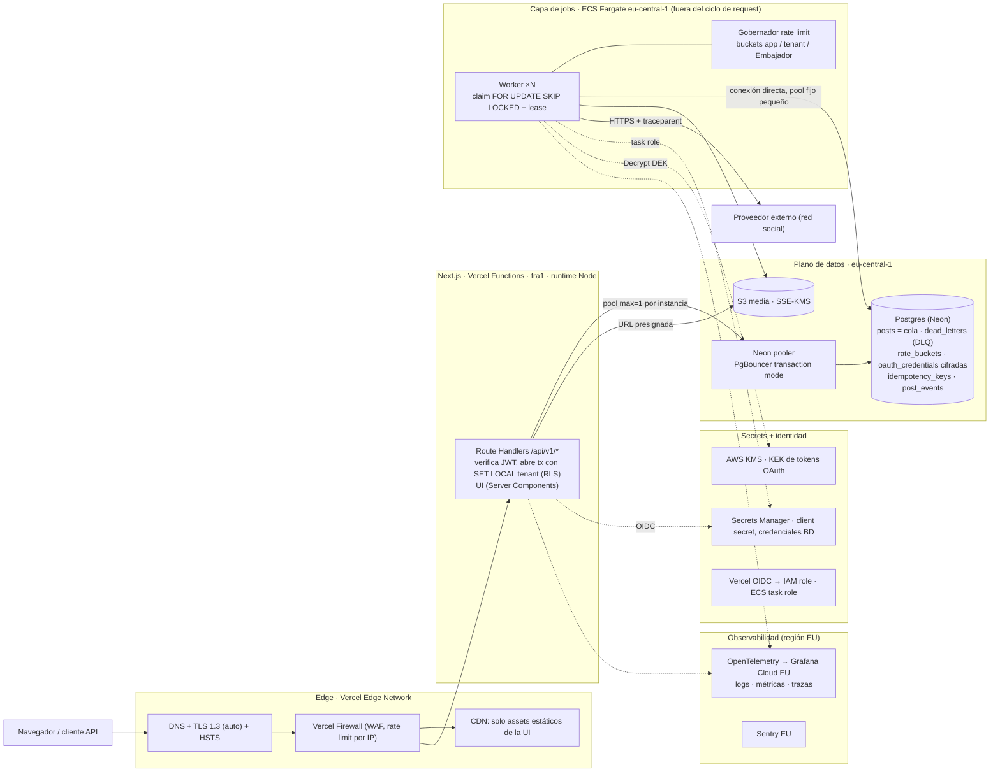

# Ploot · Prueba técnica de Backend — Respuestas escritas

> URL pública: _TODO (Parte C)_ · Repo: _TODO_

## Asunciones globales

1. "5.000 cuentas activas" = 5.000 Embajadores conectados (~500–1.000 tenants). A 50× → 250k Embajadores.
2. Volumen: ~1–3 posts/Embajador/día, concentrados en franjas (pico 09:00 CET). Hoy ≈ 10k posts/día, pico de decenas/s; a 50× ≈ 500k/día, pico de cientos/s.
3. Límites del proveedor desconocidos → configurables. Operamos **por debajo** del límite publicado (margen 20–50 %) porque el coste de un ban es mucho mayor que el de un retraso.
4. `POST /publish` ("publicar ahora") es **asíncrono**: encola con prioridad y devuelve `202`. Llamar al proveedor (0–3 s + reintentos) dentro del request rompería el p95 < 4 s y saltaría el gobernador de rate limit.
5. Ploot es **encargado** del tratamiento (GDPR); el tenant es responsable. Las solicitudes de derechos llegan vía el tenant.

---

## A. Diseño de sistema

### A.1 — Arquitectura de referencia

**Host elegido:** Vercel (Next.js, región `fra1`) + AWS `eu-central-1` (worker, KMS, Secrets Manager, S3) + Neon Postgres (AWS `eu-central-1`). Todo el dato en Frankfurt.



**Node vs Edge.** Todo lo que toca datos corre en **runtime Node en `fra1`**: `pg` necesita sockets TCP (Edge no los tiene), y una función Edge se ejecuta cerca del usuario, lejos de la BD en Frankfurt, con lo que cada query cruzaría el continente. El Edge solo sirve TLS, WAF y assets estáticos. La verificación del JWT también va en Node, dentro del Route Handler, porque el `tenant_id` del token tiene que entrar en la misma transacción de BD (RLS).

| Pieza | Elección | Alternativa descartada y su coste | €/mes a 5k |
|---|---|---|---|
| Edge | Vercel Edge Network + Vercel Firewall | Cloudflare delante: doble proxy, dos capas de caché y otra cuenta que operar, para un WAF que Vercel ya incluye | incl. |
| App | Vercel Functions, `fra1`, Node | Next.js en contenedor (ECS): más control, pero perdemos preview deploys, rollback instantáneo y autoescalado sin operar nada | ~100 (Pro + uso) |
| Worker | ECS Fargate, 2 tareas de 0,5 vCPU / 1 GB, autoescala por lag | Vercel Cron + funciones: timeouts, cold starts, sin estado de throttling, una conexión por invocación. Lambda: los mismos problemas. EC2: parcheo del SO | ~40 |
| Cola + DLQ | La tabla `posts` es la cola (`SKIP LOCKED`). DLQ = `failed` + tabla `dead_letters` | SQS: delay máximo 15 min, así que los 90 días necesitarían igualmente tabla + barredor, con *dual write* BD↔cola. BullMQ+Redis: segunda fuente de verdad que mantener en HA | 0 |
| Gobernador rate limit | Token buckets en Postgres (app / tenant / Embajador), consumidos en la misma tx que el claim | Redis + Lua: más rápido, pero otra pieza. A 5k cuentas el pico (decenas/s) cabe en Postgres. Migramos cuando la fila del bucket de app tenga contención (~cientos de claims/s) | 0 |
| Bóveda de tokens | Postgres con cifrado *envelope*: AES-256-GCM con DEK por Embajador, envuelta por una KEK de KMS | Secrets Manager por token: 0,40 $/secreto → 2k $/mes hoy y 100k $/mes a 50×, además de su rate limit de API. HashiCorp Vault: operar un clúster HA | ~10 (KMS) |
| Postgres | Neon (eu-central-1), PITR de 14 días, pooler integrado, rama por PR | RDS + RDS Proxy: más control, pero desde Vercel necesita endpoint público o Secure Compute (~6,5k $/año) y no tiene ramas para las previews | ~150–300 |
| Pooler | Neon pooler (PgBouncer, transaction mode) para la app; conexión directa para los workers | RDS Proxy (no aplica con Neon). Prisma Accelerate: otro proveedor más en el camino crítico | incl. |
| Caché | **Ninguna dedicada** al principio | Redis: no hay nada con valor que cachear. Las lecturas son por tenant y pequeñas, y la idempotencia necesita durabilidad transaccional (Postgres). Upstash EU sería el siguiente paso, para el gobernador | 0 |
| Object storage | S3 eu-central-1 con SSE-KMS; subida presignada directa desde el cliente | Vercel Blob: sin garantía de región UE. Guardar media en Postgres: infla backups y PITR | ~10–30 |
| Secrets / identidad | Secrets Manager + KMS; la app entra por Vercel OIDC → IAM role y el worker por ECS task role | Variables de entorno estáticas en Vercel: visibles en el dashboard, se cuelan en previews y se rotan a mano | ~5 |
| Observabilidad | OpenTelemetry → Grafana Cloud EU; Sentry EU | Datadog: el coste de logs se dispara con el volumen. Solo CloudWatch: no correlaciona con Vercel | ~50–100 |
| **Total** | | | **~400–650 €/mes (orden: 500 €)** |

### A.2 — Tokens, rate limits, datos y conexiones

**1. Tokens OAuth.**
- **Dónde y cómo se cifran.** Los tokens viven en la tabla `oauth_credentials` (`tenant_id`, `ambassador_id`, `access_ct`, `refresh_ct`, `wrapped_dek`, `expires_at`, `status valid|expired|revoked`). Se cifran con AES-256-GCM usando una DEK por Embajador; la DEK va envuelta por una KEK de KMS que nunca sale de KMS. El AAD es `tenant_id‖ambassador_id`, así que un ciphertext copiado a otra fila no descifra. Solo el rol del worker tiene `kms:Decrypt`; el rol de la app no tiene `SELECT` sobre esas columnas.
- **Refresco antes de expirar.** Es proactivo: un barrido cada minuto coge con `SKIP LOCKED` los tokens con `expires_at < now()+10 min`. Además hay un refresco *just-in-time* antes de publicar. La fila de credencial se bloquea con `FOR UPDATE`, para que dos workers no refresquen a la vez: con *refresh token rotation*, el segundo invalidaría al primero.
- **Revocado a mitad de lote.** El refresh devuelve `invalid_grant` → la credencial pasa a `revoked` y el post en curso a `failed/TOKEN_REVOKED`, sin gastar reintentos. El resto de posts de ese Embajador pasa a `blocked_reauth`: no se queman, se reanudan si reconecta dentro de su ventana, y se le notifica. El claim es por post, así que el resto del lote, de otros Embajadores, no se ve afectado.
- **Tenancy.** Modelo *pool*: tabla compartida con `tenant_id` + RLS, y aislamiento criptográfico por DEK. Descartamos un silo por tenant (5k esquemas o BDs que migrar).

**2. Gobierno del rate limit.**
- **Mecanismo.** Token buckets jerárquicos en Postgres que se consumen en la misma transacción que el claim (`UPDATE rate_buckets SET tokens = least(cap, tokens + rate*Δt) - 1 WHERE key=$1 AND …>= 1`; si no hay token, el post no se reclama):
  - **App:** 80 % de la cuota real del proveedor.
  - **Embajador:** ≤ 50 % de su límite, un solo post en vuelo y un jitter de ±N s, para no publicar con patrón de bot.
  - **Equidad entre tenants:** el claim reparte en *round-robin* por tenant, con como mucho *k* posts por tenant y ciclo. Un tenant con 50 Embajadores × 100 posts a las 09:00 recibe su parte justa mientras otros tengan trabajo, y usa la capacidad sobrante cuando no la tienen (*work-conserving*, max-min fairness).
- **Respuesta a 429.** Un 429 de un Embajador fija `paused_until` desde `Retry-After`. Un 429 de app abre un *circuit breaker* global y aplica AIMD: la tasa se reduce ×0,5 y luego recupera de forma lineal.
- **Modos de fallo.**
  - Si la BD del gobernador no responde → **fail closed**: no se publica. Retrasar es recuperable; un ban no lo es.
  - La fila del bucket de app es un *hot row* en el pico. Mitigación: un único *dispatcher* (líder por advisory lock) reparte tokens en lotes a los workers, o se mueve a Redis.

**3. Query caliente + conexiones bajo serverless.**
- **Índice.** Índice parcial `CREATE INDEX posts_due ON posts (tenant_id, scheduled_at) WHERE status = 'scheduled';`. Los millones de filas `published` no entran en él.
- **Query justa.** `LATERAL` por tenant activo:
  ```sql
  SELECT p.id FROM active_tenants t
  CROSS JOIN LATERAL (
    SELECT id FROM posts
    WHERE tenant_id = t.id AND status = 'scheduled' AND scheduled_at <= now()
    ORDER BY scheduled_at LIMIT 5 FOR UPDATE SKIP LOCKED) p
  LIMIT 200;
  ```
  El `EXPLAIN` esperado es `Limit → Nested Loop → Seq Scan active_tenants → Limit → LockRows → Index Scan using posts_due (Index Cond: tenant_id = t.id AND scheduled_at <= now())`. El coste es O(tenants × 5) y no depende de que un tenant tenga 5M filas. Un `ORDER BY scheduled_at` global, en cambio, haría que el tenant grande acaparase el lote.
- **Conexiones desde la app.** Cada instancia serverless usa la URL del **pooler** (PgBouncer, *transaction mode*) con `max: 1`. El pooler multiplexa miles de clientes sobre ~50–100 conexiones reales.
- **Implicaciones del transaction mode.** No hay estado de sesión: el tenant se fija con `set_config('app.tenant_id', $1, true)` (equivalente a `SET LOCAL`) dentro de la tx, y no se usan advisory locks de sesión ni `LISTEN`. Con los prepared statements, usamos `pg` con sentencias sin nombre, que no tienen problema. Prisma necesitaría `pgbouncer=true`, o PgBouncer ≥ 1.21 con `max_prepared_statements`.
- **Conexiones del worker.** El worker, de larga vida, va **directo**, sin pooler, con un pool fijo de 5 por réplica, y aquí sí puede usar advisory locks de sesión.
- **Presupuesto.** `max_connections` ≥ pool del pooler + N workers × 5 + reserva de administración.

**4. GDPR — borrado de un Embajador.**
- **Encaje legal.** Se ejecuta como job idempotente (`erasure_requests`) a petición del tenant, que es el responsable.
- **Tokens.** Se revocan en el proveedor y se borra la fila con su `wrapped_dek`.
- **Posts en cola.** Se cancelan y se borran.
- **Posts publicados.** Se borra el contenido y la media en S3, y se conserva una fila mínima sin PII (`id`, `tenant_id`, `published_at`) para la facturación por uso. El dato contable, facturas del tenant que se conservan 6 años (art. 30 Código de Comercio), es de la empresa y no del Embajador.
- **Anonimización.** La fila del Embajador se anonimiza (nombre y email a `NULL`, handle a un hash) para mantener la integridad referencial.
- **Contenido en la red social.** Lo publicado allí está en la cuenta del propio Embajador. Si lo pide, se borra vía API **antes** de revocar el token.
- **Rastros:**
  - **Logs:** no contienen PII por diseño (solo IDs, nunca contenido) y caducan a 30 días.
  - **Cachés:** no hay caché de datos del tenant; la API responde con `Cache-Control: private, no-store`.
  - **Backups:** el PITR caduca a los 14 días, y una **lista de supresión** (IDs borrados) se reaplica tras cualquier restore. Al borrar la DEK, el material cifrado que quede en backups es ilegible mientras caducan.
- **Prueba.** Se guarda un registro de auditoría sin PII (id de solicitud y fecha).

---

## B. Despliegue y operación

### B.1 — Topología de despliegue y capa asíncrona

- **App Next.js.** Vercel, funciones en `fra1`, con TLS automático y HSTS. Las variables de entorno van por entorno (Development, Preview y Production en Vercel) y contienen solo configuración no secreta y el ARN del rol OIDC. Los secretos se leen de Secrets Manager en runtime. Las previews nunca ven secretos de producción.
- **Worker de larga vida.** Contenedor en Fargate en producción; en la demo, ver la Parte C. No puede ser una función de Next.js por varias razones:
  - Las funciones tienen timeout y cold start.
  - Vercel Cron tiene una granularidad de ≥ 1 min.
  - No conservan el estado del throttling (buckets, backoff, `paused_until` en memoria como caché).
  - Cada invocación abre conexiones nuevas.

  El proceso de larga vida mantiene un pool fijo, renueva leases y hace un *drain* ordenado con SIGTERM: deja de reclamar, termina lo que tiene en vuelo y libera los leases.
- **Cola + DLQ en Postgres.** El estado del post *es* el job, así que el claim y la transición de estado son atómicos, sin *dual write*. Los 90 días de antelación son nativos (`scheduled_at`) y la cola se audita con SQL. La DLQ está formada por los `failed` más `dead_letters`, que guarda el último error y el payload, con *replay* vía endpoint de admin. El límite (cientos a miles de claims/s) sobra para 50×.
- **Postgres.** Neon eu-central-1, con cifrado en reposo AES-256 gestionado, TLS obligatorio (`sslmode=verify-full`), PITR de 14 días y un `pg_dump` diario a S3 UE (copia fuera del proveedor). El pooler va delante de la app; los workers conectan directos.
- **Secretos por identidad de workload.**
  - La app usa Vercel OIDC → `AssumeRoleWithWebIdentity`, con credenciales de 1 h; el worker usa el ECS task role.
  - Los tokens OAuth quedan cifrados en Postgres, con la KEK en KMS.
  - El IaC solo referencia ARNs; los valores se cargan fuera de banda y el state va cifrado en S3.
  - *Simplificación en la demo:* la clave de cifrado es una variable de entorno del host (deuda declarada).

### B.2 — CI/CD y observabilidad

**1. Forma del pipeline** (GitHub Actions).
- **En cada PR.** Se ejecutan:
  - lint y typecheck;
  - tests unitarios y de integración contra un Postgres de servicio (concurrencia, RLS, DST e idempotencia);
  - `gitleaks`;
  - build de las imágenes del worker y del mock.

  Además se crea una rama de Neon para el PR, donde se aplican las migraciones, y un preview deploy de Vercel apuntando a esa rama.
- **Al mergear a `main`.** Se construyen las imágenes con tag del SHA y se suben a GHCR o ECR. Se ejecuta *una vez* el job de migraciones (solo *expand*). Se despliega en staging y se pasa un smoke e2e: crear un post, publicarlo contra el mock y verificar `published`.
- **Paso a producción.** Usa un GitHub Environment con **aprobación manual**. Lo bloquean cualquier check en rojo, una migración fallida o un smoke fallido.
- **Rollback automático.** Durante 15 min tras el deploy se vigilan tres señales: la tasa de publicación exitosa (si cae más de 5 puntos frente a la línea base), los 5xx de la API (si superan el 2 %) y el p95 (si supera 4 s). Si alguna salta, se hace *instant rollback* en Vercel y se activa el circuit breaker de despliegue de ECS. Es seguro porque las migraciones son siempre compatibles con la versión anterior.

**2. Migraciones.**
- **Una sola vez.** Nunca se ejecutan al arrancar la app (N instancias competirían). Las corre un único job del pipeline (`concurrency` group), protegido además con `pg_advisory_lock`, `lock_timeout` y `statement_timeout`.
- **Expand/contract.**
  - **Release N:** añade columnas nullable, tablas nuevas e índices `CONCURRENTLY`.
  - **Release N+1:** escribe en ambos esquemas y lee del nuevo; el backfill se hace por lotes desde el worker.
  - **Release N+2:** hace el *contract* (DROP), solo cuando ya no puede volver una versión anterior a N+1.
- **Regla.** Toda migración es compatible con el código anterior, así que un rollback de Vercel nunca encuentra un esquema incompatible.

**3. Golden signals + negocio.**
- **Latencia:** p95 de la API (SLO < 4 s) y latencia de la llamada al proveedor.
- **Tráfico:** req/s y claims/s.
- **Errores:** 5xx de la API, 5xx del proveedor y tasa de `TOKEN_REVOKED`.
- **Saturación:** conexiones de BD y del pooler, slots de concurrencia del worker y **consumo del bucket de rate limit de app**.
- **Negocio:** **lag de publicación** (`published_at − scheduled_at`, p95, y la edad del post vencido más antiguo), más la tasa de éxito por tenant.

**Pagina a un humano:**
- lag p95 > 10 min sostenido, porque la promesa del producto está rota y el cliente lo ve;
- tasa de 429 de app > umbral o circuit breaker abierto > 5 min, porque hay riesgo de ban, que es irreversible;
- conexiones de BD > 90 %, porque precede a una caída total.

**Solo abre ticket:**
- caída de éxito de *un* tenant (normalmente tokens; se resuelve en horario laboral);
- p95 > 4 s;
- 5xx del proveedor absorbidos por los reintentos;
- crecimiento de la DLQ.

Criterio: se pagina solo por síntomas que dañan al usuario o a sus cuentas *ahora* y que necesitan a un humano.

**4. Tracing distribuido.** Se usa W3C `traceparent` y OpenTelemetry (`@vercel/otel`).
- **Route Handler → cola.** Como la cola es una tabla, el contexto viaja **como dato**: el Route Handler guarda `trace_context` en la fila del post.
- **Cola → worker.** Al reclamar, el worker crea un span con **link** al span original. No lo hace como hijo porque el post puede ejecutarse 90 días después, y una traza abierta tanto tiempo no sirve.
- **Worker → proveedor.** El worker propaga `traceparent` en la llamada HTTP al proveedor y registra el `external_id` y el request-id del proveedor.
- **Claves de correlación.** Todos los logs llevan `trace_id` y `post_id`; `post_id` es la clave de correlación estable.

### B.3 — Seguridad

**1. Inventario de secretos.**

| Secreto | Dónde vive | Rotación |
|---|---|---|
| Token OAuth por Embajador | Postgres, cifrado envelope (DEK + KEK de KMS) | El access token rota solo vía refresh. La KEK rota automáticamente cada año en KMS (las versiones antiguas siguen descifrando); las DEK se re-envuelven de forma perezosa |
| Client secret del proveedor | Secrets Manager, leído por el worker (task role) | Se crea un segundo secret en el proveedor, se actualiza en Secrets Manager (los workers lo releen con TTL de 5 min) y se revoca el antiguo. Cada 90 días o ante incidente |
| Credenciales de BD | Secrets Manager; roles separados: `app` (RLS, sin BYPASS), `worker`, `migrator` (DDL, solo CI) | Rotación con usuarios alternos (Secrets Manager rotation) cada 90 días |
| Claves de cifrado (KEK) | KMS, no exportables | Automática anual; `Decrypt` solo para el rol del worker |
| Clave de firma JWT | Secrets Manager / JWKS con `kid` | Solapamiento de dos claves durante la rotación |

**Riesgo de las variables de entorno en Vercel:**
- son visibles para cualquiera con acceso al proyecto (dashboard y `vercel env pull`);
- se heredan en previews, así que una rama maliciosa podría exfiltrarlas;
- pueden acabar en logs si se serializa `process.env`;
- un prefijo `NEXT_PUBLIC_` por error las mete en el bundle del cliente;
- tienden a no rotarse nunca.

Mitigación: en env solo va configuración no secreta y el ARN para OIDC.

**2. Sin credenciales permanentes de producción.** Nadie tiene un usuario de BD de producción.
- **Acceso JIT.** Se pide con un comando (`ops db-access --incident INC-123`) vía SSO.
  - El on-call con incidente abierto se auto-aprueba; fuera de incidente hace falta una segunda persona.
  - El comando crea un rol temporal `jit_<user>` con `VALID UNTIL now()+1h`, de solo lectura y sin acceso a `oauth_credentials`.
- **Escritura.** Requiere *four-eyes*.
- **Auditoría.** Todo queda registrado con `pgaudit`.
- **Tiempo.** Son unos 2 min. Más adelante, Teleport o StrongDM.

**3. Tres controles diferidos 6 meses:**
1. **Certificación SOC 2 / ISO 27001.** Cuesta meses de proceso y 20–50k € de auditoría. Aplicamos las prácticas sin la auditoría hasta que un deal enterprise la exija.
2. **Red privada hacia la BD** (Secure Compute o VPC peering, ~6,5k $/año). La compensamos con TLS `verify-full`, credenciales de corta vida y allowlist de IPs.
3. **BYOK / claves gestionadas por el cliente** y HSM dedicado. El ciclo de vida de claves por cliente es complejo; una KEK en KMS con DEK por Embajador cubre el riesgo real.

Diferirlos es correcto porque el riesgo residual es bajo, hay controles compensatorios y para un equipo pequeño cada uno cuesta semanas que hoy deben ir al producto.
